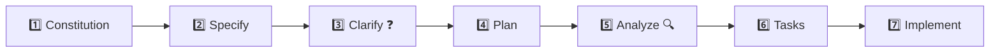

# 🌱 دليل Spec-Kit الشامل لمشروع NanoMD

---

## الصورة الكبيرة



| المرحلة | الكوماند | إلزامي؟ | الوظيفة |
|---------|---------|---------|---------|
| 1 | `/speckit.constitution` | ✅ | دستور المشروع وقواعده الحاكمة |
| 2 | `/speckit.specify` | ✅ | مواصفات الفيتشر الفنية |
| 3 | `/speckit.clarify` | ❓ اختياري | أسئلة توضيحية لسد الفجوات |
| 4 | `/speckit.plan` | ✅ | خطة التنفيذ التقنية |
| 5 | `/speckit.analyze` | ❓ اختياري | فحص التوافق بين الملفات |
| 6 | `/speckit.tasks` | ✅ | تفصيل المهام بالتبعيات |
| 7 | `/speckit.implement` | ✅ | التنفيذ الفعلي |

---

## أين تذهب الملفات؟

```
NanoMD/
├── .specify/
│   ├── memory/
│   │   └── constitution.md          ← الدستور (مرحلة 1)
│   └── features/
│       └── 001-nanomd-mvp/          ← فولدر الفيتشر
│           ├── spec.md              ← المواصفات (مرحلة 2)
│           ├── plan.md              ← خطة التنفيذ (مرحلة 4)
│           └── tasks.md             ← المهام (مرحلة 6)
└── .agent/
    └── workflows/                   ← كوماندز Spec-Kit
```

---

## المرحلة 1: الدستور (`/speckit.constitution`)

### إيه ده؟

ملف يحدد القواعد والمبادئ الحاكمة للمشروع كله. كل قرار تقني بعد كده لازم يتوافق مع الدستور ده.

### إيه اللي بيحصل؟

1. بيقرأ الـ template من `.specify/templates/constitution-template.md`
2. بيملأ الـ placeholders بالقيم الحقيقية
3. بيحفظ في `.specify/memory/constitution.md`

### البرومبت الجاهز

```
/speckit.constitution

NanoMD is an Arabic-first static Markdown viewer website focused on reading AI-generated text.

Core Principles:
1. Reading First - Default mode is always formatted preview, editing is secondary
2. Absolute Simplicity - Minimum visible buttons, zero complexity for users
3. Silent Intelligence - The app understands the user without asking
4. Arabic Native - Full RTL from the first line of code
5. Mobile First - Design for mobile, scale up to desktop
6. Zero Friction - No accounts, no login, no server
7. Nano Banana Spirit - Simple, fun, warm colors, smooth animations

Tech Stack (fixed, non-negotiable):
- React 18.2+ with TypeScript 5+
- Vite 5+ with pnpm
- Tailwind CSS 3.4+
- react-markdown 9+ with remark-gfm, rehype-highlight, rehype-sanitize
- Lucide React icons, Google Fonts Cairo
- Hosting: Cloudflare Pages (free tier)
- No backend, no database, localStorage only

Quality Standards:
- All code in English, UI text in Arabic
- Lighthouse score > 90
- Bundle size < 150KB gzipped
- Support Chrome, Firefox, Safari
- Mobile, tablet, and desktop responsive
```

---

## المرحلة 2: المواصفات (`/speckit.specify`)

### إيه ده؟

ملف مواصفات الفيتشر — بيوصف إيه اللي هنبنيه بالظبط من ناحية المستخدم (الـ What والـ Why)، مش الكود.

### إيه اللي بيحصل؟

1. بيقرأ الدستور اللي عملناه
2. بيقرأ رؤية المشروع اللي هتديهاله
3. بيحول الكلام لـ spec رسمي بصيغة محددة
4. بيحفظ في `.specify/features/001-nanomd-mvp/spec.md`

### البرومبت الجاهز

```
/speckit.specify

Build the NanoMD MVP 1.0 - a static Arabic Markdown viewer website.

The full detailed vision document is at: 01-NanoMD.md (read it completely before proceeding)

Key User Flows:
1. User copies text from AI tools (ChatGPT/Claude)
2. Opens NanoMD
3. Presses Ctrl+V anywhere on the page
4. Text appears formatted and beautiful instantly
5. User reads, copies formatted text, prints, or optionally edits

Core Features for MVP:
- Smart Paste: Ctrl+V anywhere pastes and shows formatted preview
- 4 View Modes: Preview (default), Editor, Split (⅓ editor + ⅔ preview), Focus
- 3 Themes: Light (default), Dark, Warm (banana-inspired)
- Full RTL Arabic support with Cairo font
- Markdown rendering with GFM tables, code highlighting, checkboxes
- Copy menu: Rich Text, Markdown, HTML, Print/PDF, Save as .md file
- Templates: Blank, Article, Report, Tasks, Comparison, Documentation
- Drag & Drop .md/.txt files
- Auto-save to localStorage with version history (last 5 versions)
- Keyboard shortcuts (Ctrl+1/2/3 for views, Ctrl+B/I/K for formatting)
- Tool Drawer (desktop sidebar) and Bottom Sheet (mobile) for formatting
- Mobile bottom navigation bar (Preview/Edit tabs)
- Toast notifications
- Code blocks with copy button on hover
- Print-friendly CSS (@media print)

Components (14 total): Header, EmptyState, PreviewPane, EditorPane, SplitView, FocusMode, ToolDrawer, BottomSheet, MobileNav, CopyMenu, Toast, ThemeToggle, SaveIndicator, App

Non-goals for MVP: TTS, AI integration, slides, i18n, PWA, multi-tabs, synchronized scroll, search/replace, LaTeX, Mermaid, .docx import
```

---

## المرحلة 3 (اختياري): التوضيح (`/speckit.clarify`)

### إيه ده؟

بيسأل أسئلة ذكية عن الحاجات الغامضة في المواصفات عشان يسد الثغرات قبل ما نخطط.

### إيه اللي بيحصل؟

1. بيقرأ الـ spec اللي عملناه
2. بيطلع أسئلة توضيحية (حتى 5)
3. بعد ما تجاوبه، بيحدث الـ spec بالإجابات

### البرومبت الجاهز

```
/speckit.clarify
```

> **ملاحظة:** مش محتاج تكتب حاجة — هو هيقرأ الـ spec ويسألك. بس أنا شايف إن الرؤية بتاعتك مفصلة جداً فممكن تتخطى المرحلة دي.

---

## المرحلة 4: خطة التنفيذ (`/speckit.plan`)

### إيه ده؟

الخطة التقنية — بتحدد إزاي هنبني الحاجة فعلياً (الـ How). بتتضمن هيكل الملفات، البنية، والتبعيات.

### إيه اللي بيحصل؟

1. بيقرأ الدستور + المواصفات
2. بيصمم الـ architecture والـ file structure
3. بيحفظ في `.specify/features/001-nanomd-mvp/plan.md`

### البرومبت الجاهز

```
/speckit.plan

Technical decisions (non-negotiable):
- React 18.2+ with TypeScript 5+ using Vite 5+
- Package manager: pnpm
- Styling: Tailwind CSS 3.4+ with CSS Variables for theming
- Markdown: react-markdown 9+ with remark-gfm 4+, rehype-highlight 7+, rehype-sanitize 6+
- Icons: Lucide React, Font: Google Fonts Cairo
- Hosting: Cloudflare Pages
- No backend, no database — localStorage only

Architecture notes:
- Full file structure is defined in the vision document 01-NanoMD.md
- Use React Context for Theme, Content, and ViewMode
- Custom hooks for all reusable logic (useLocalStorage, useTheme, useAutoSave, useSmartPaste, useKeyboard, useViewMode, useMediaQuery)
- CSS structured as: globals.css (Tailwind directives), preview.css (markdown styling), themes.css (3 theme definitions using CSS variables)
- Mobile-first responsive design with breakpoints: Mobile <640px, Tablet 640-1023px, Desktop 1024+
- Bundle target: <150KB gzipped
- Support last 2 versions of Chrome, Firefox, Safari
```

---

## المرحلة 5 (اختياري): التحليل (`/speckit.analyze`)

### إيه ده؟

فحص شامل للتوافق بين الدستور والمواصفات وخطة التنفيذ — بيتأكد إن مفيش تناقضات.

### إيه اللي بيحصل؟

1. بيقرأ الملفات التلاتة (constitution, spec, plan)
2. بيطلع تقرير بالتناقضات أو الثغرات
3. بيقترح تعديلات

### البرومبت الجاهز

```
/speckit.analyze
```

> **ملاحظة:** مش محتاج تكتب حاجة — هو هيقرأ الملفات ويحلل لوحده.

---

## المرحلة 6: تفصيل المهام (`/speckit.tasks`)

### إيه ده؟

بيحول خطة التنفيذ لمهام مرتبة بتبعياتها — كل مهمة فيها وصف واضح، الملفات المتأثرة، ومعايير القبول.

### إيه اللي بيحصل؟

1. بيقرأ الخطة
2. بيقسم التنفيذ لمهام مرقمة
3. بيحدد التبعيات بين المهام
4. بيحفظ في `.specify/features/001-nanomd-mvp/tasks.md`

### البرومبت الجاهز

```
/speckit.tasks
```

> **ملاحظة:** مش محتاج تكتب حاجة — هو هيقرأ الخطة ويفصل المهام لوحده.

---

## المرحلة 7: التنفيذ (`/speckit.implement`)

### إيه ده؟

بيبدأ ينفذ المهام واحدة واحدة بالترتيب اللي حدده في المرحلة السابقة.

### إيه اللي بيحصل؟

1. بيقرأ ملف المهام
2. بينفذ كل مهمة بالترتيب
3. بيحدث حالة المهمة لما يخلصها

### البرومبت الجاهز

```
/speckit.implement
```

> **ملاحظة:** مش محتاج تكتب حاجة — هو هينفذ المهام بالترتيب لوحده.

---

## الكوماندز الإضافية

| الكوماند | متى تستخدمه | البرومبت |
|----------|------------|----------|
| `/speckit.checklist` | بعد الخطة — لعمل قوائم فحص جودة | `/speckit.checklist` |
| `/speckit.taskstoissues` | بعد المهام — لتحويلها لـ GitHub Issues | `/speckit.taskstoissues` |

---

## الترتيب المختصر

```
الخطوة 1 ➜ /speckit.constitution  (الدستور)
الخطوة 2 ➜ /speckit.specify       (المواصفات)
الخطوة 3 ➜ /speckit.clarify       (اختياري — توضيح)
الخطوة 4 ➜ /speckit.plan          (خطة التنفيذ)
الخطوة 5 ➜ /speckit.analyze       (اختياري — فحص التوافق)
الخطوة 6 ➜ /speckit.tasks         (تفصيل المهام)
الخطوة 7 ➜ /speckit.implement     (التنفيذ)
```

> [!IMPORTANT]
> كل مرحلة لازم تخلص وتتراجع قبل ما تبدأ اللي بعدها.
> الوكيل هيعرض عليك الناتج — راجعه واطلب تعديلات لو محتاج، وبعدين ابدأ المرحلة اللي بعدها.

> [!TIP]
> المراحل الاختيارية (3 و 5) مفيدة لما الرؤية مش واضحة بالكامل. في حالتك الرؤية مفصلة جداً فممكن تتخطاهم.
